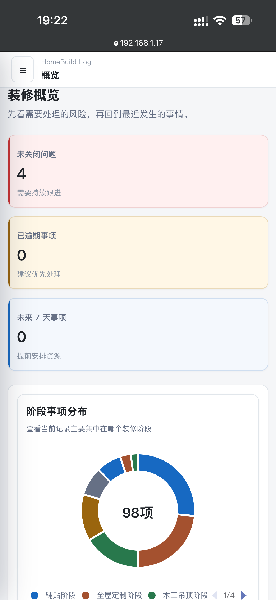
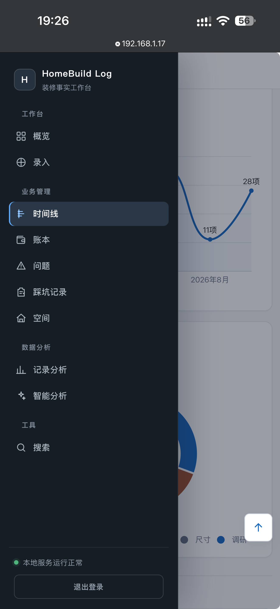

# HomeBuild Log

> 本地优先的个人装修事实工作台：保存原始资料，整理事件、账目、问题、尺寸、决策和调研记录，让装修过程有据可查。

HomeBuild Log 面向自己管理装修过程的个人业主。把分散在聊天记录、票据、相册和备忘录里的装修信息集中保存，并通过“原始来源 → 候选信息 → 人工确认 → 正式记录”的方式，避免未经确认的内容直接进入正式档案。

项目采用 React、TypeScript、FastAPI 和 SQLite 构建，Docker 运行 。业务数据默认保存在本地目录中，AI 分析功能默认关闭。

## 运行指南

推荐使用 **Linux + Docker** 运行 HomeBuild Log。完整的构建说明请查看 [Docker 本地快速部署](deploy/README-DOCKER-QUICKSTART.md)。使用预先导出的镜像部署时，请查看 [Ubuntu 部署说明](deploy/README-UBUNTU.md)。

### Windows 本地运行

获取源码：
```bash
git clone https://github.com/827238158/HomeBuild-Log.git
```

安装前后端依赖：
```bash
py -3.13 -m venv .venv
.venv\Scripts\activate.bat
python -m pip install -r backend\requirements.lock -i https://pypi.tuna.tsinghua.edu.cn/simple
python -m pip install -e backend --no-deps
npm --prefix .\frontend ci --registry=https://registry.npmmirror.com
```

首次运行或项目升级后，需要初始化或升级数据库：

```cmd
pushd backend
..\.venv\Scripts\python.exe -m alembic -c alembic.ini upgrade head
popd
```

该命令会将数据库升级到最新结构。已经是最新版本时不会重复修改；如果迁移失败，请不要继续启动后端。

Windows手动启动前后端：
后端：
```bash
.venv\Scripts\activate.bat
cd backend
python -m fastapi dev app/main.py --host 127.0.0.1 --port 8000
```

前端：
```bash
.venv\Scripts\activate.bat
cd frontend
npm run dev
```

前端页面：
```text
http://127.0.0.1:8000
```
首次启动后端时，程序会在 .local-data/config/secrets.json 不存在的情况下自动创建配置，并在启动日志中显示随机管理员密码，请立即保存。配置文件仅保存密码哈希。需要自定义密码时，应生成新密码的哈希并替换 admin_password_hash，保留文件中的其他字段；删除整个配置文件会重新生成登录密钥及默认配置。
AI 模型的 API Key 写在 .local-data/config/secrets.json 中，目前仅支持openai格式调用API。

## 界面预览

**手机端装修概览**：查看待处理问题、近期事项和装修阶段分布。



**手机端功能导航**：按需要进入时间线、账本、问题、空间、分析和搜索。



## 为什么需要 HomeBuild Log

装修要决定的事很多，但信息往往分散在微信聊天、现场口头沟通、报价单、付款凭证、照片和备忘录里。常会遇些问题：

- 装修公司说过的施工方案、效果、材料、尺寸等等，时间长了记不清最终确认的是哪一版；
- 报价、增项、付款、退款、人情......后面想知道在哪花了多少钱很费劲；
- 出现漏水、空鼓、尺寸不符、效果不达标等问题后，照片、沟通经过和处理结果难以放在一起回溯；
- 施工出了错，为什么这样做、是怎么敲定的，过一段时间就难以追溯是谁的责任；
- 想按主卧、客厅、厨卫等空间查看开销、用了什么材料、出现了什么问题，只能翻聊天记录。

HomeBuild Log 保存原始资料，把确认过的信息整理成可查找、可关联的装修记录。

## 核心功能

- **重要资料留得住**：随手记录，可附上图片或 PDF，把沟通内容、票据和现场资料留作依据；
- **装修的事分门别类**：把施工事件、收支、问题、尺寸、决策和调研结果整理在一起；
- **前因后果连得起来**：关联相关记录，例如把一个施工问题与对应的照片、处理过程和费用放在一起查看；
- **花费心里有数**：记录付款、退款和收入，查看装修净支出；
- **问题跟得上、房间找得到**：按不同紧急程度跟进待处理事项，按房间或区域查看相关记录；
- **看得清，也找得到**：从图表了解装修进展和花费，想知道数字从哪来，就能找到对应记录，回看当时发生了什么；
- **AI 按需使用**：配置AI辅助整理内容；不配置 AI 时仍可使用本地规则。

## 工作流程

```text
遇到一件需要记住的装修事
        ↓
说明情况，按需附上照片或文件
        ↓
检查自动整理出的信息，确认后保存
        ↓
按需把相关的费用、问题、尺寸或决定关联起来
        ↓
以后按时间或关键词回溯；需要复盘时查看账本、问题等页面
```

## 技术架构

| 层级 | 技术 |
| --- | --- |
| 前端 | React、TypeScript、Vite、ECharts |
| 后端 | Python、FastAPI、SQLAlchemy、Alembic |
| 数据 | SQLite、本地附件目录 |
| 部署 | Docker、Docker Compose |
| 测试 | Pytest、Vitest |

## 数据与隐私

运行数据统一位于项目根目录或部署目录下的 `.local-data/`，包括：

- SQLite 数据库；
- 用户上传的附件；
- 管理员认证配置；
- 可选的 AI 配置。

部署时默认只监听 `127.0.0.1`，不会直接向局域网或公网开放。需要从其他设备访问时，应先完成访问控制、网络边界和备份方案验证。

## 项目文档

| 文档 | 用途 |
| --- | --- |
| [Docker 本地快速部署](deploy/README-DOCKER-QUICKSTART.md) | Ubuntu 从源码构建镜像并启动容器 |
| [Ubuntu 离线部署说明](deploy/README-UBUNTU.md) | 使用镜像归档和校验文件部署 |
| [运行手册](memory/RUNBOOK.md) | 启动、测试、构建、迁移和恢复命令 |
| [设计规范](DESIGN.md) | UI、视觉和交互规则 |
| [数据库迁移说明](backend/migrations/README.md) | 数据库迁移子系统入口 |

## 项目定位

HomeBuild Log 当前首先服务于个人、本地和可信环境，不是面向公网多用户场景设计的 SaaS。项目仍在持续开发中，现阶段更适合个人试用。
